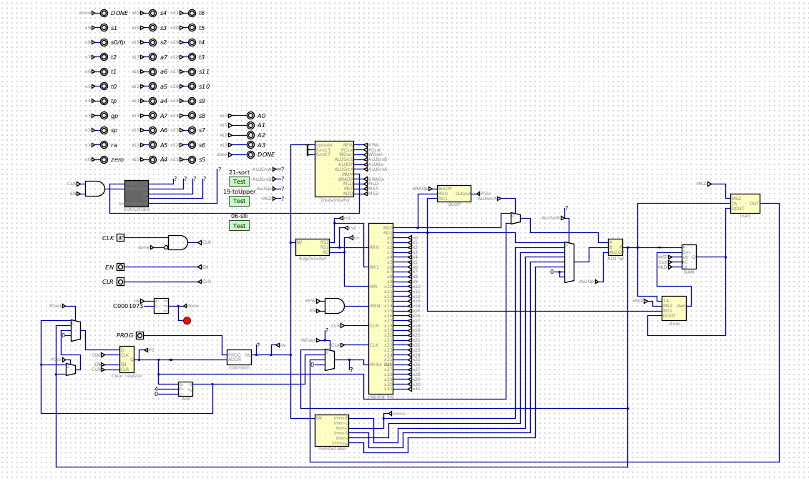
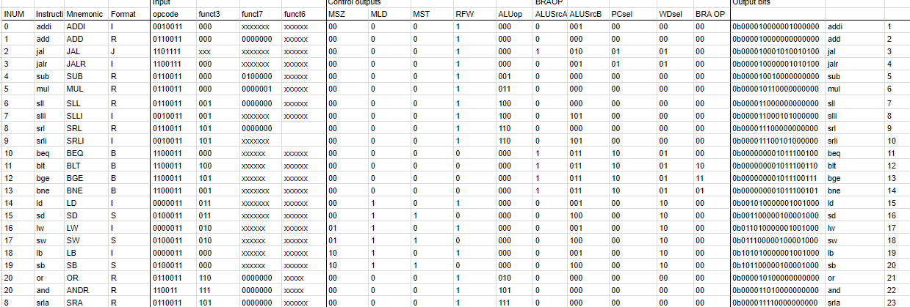

# Single-Cycle RISC-V Processor Implementation

## Overview

This project involves designing and implementing a single-cycle RISC-V processor using the Digital circuit design tool. The processor was built entirely from scratch, including all sub-components, and supports a subset of the RISC-V instruction set architecture. The implementation passes all unit tests and program tests provided for the assignment.

## Features

Major Sub-Circuits

### Program Counter (PC):

A 64-bit register with enable (EN) and clear (CLR) inputs.

### Instruction Memory:

ROM components store machine code programs, allowing selection of different programs for execution.

### Register File:

Supports reading two registers (RD0, RD1) in a single clock cycle.

#### Arithmetic Logic Unit (ALU):

Performs operations including addition, subtraction, multiplication, and shifts (sll, slr, sra).

### Branch Control Unit (BCU):

Handles conditional branching and program counter updates.

### Data Memory:

Configured for 64-bit word values using Digital’s RAM component, supporting ld, sd, and word- and byte-size memory operations.

### Control Unit:

Decodes machine code instructions and generates control signals for various operations.

### Data Path:

Connects data between sub-circuits.

### Control Path:

Connects the Control Unit to sub-circuits and multiplexers.

Outputs

The top-level processor circuit includes outputs for registers A0, A1, A2, and A3.

### Unit Testing:

Passed all provided automated unit tests.

Program Testing:

Passed all automated program tests, ensuring complete functionality of the processor.

Deliverables

## The project includes:

### Circuit Files:

.dig files for the processor and all sub-circuits.

Instruction Memory Files:

.hex files for machine code programs.

### Control ROM Spreadsheets:

Excel exports of the instruction decoder ROM spreadsheets.

Tools Used

Digital Circuit Design Tool:

Used for creating and simulating the processor and its sub-circuits.

## Testing

The provided unit tests and program tests were used to validate the functionality of the processor.

Additional manual testing ensured proper execution of all required operations.
